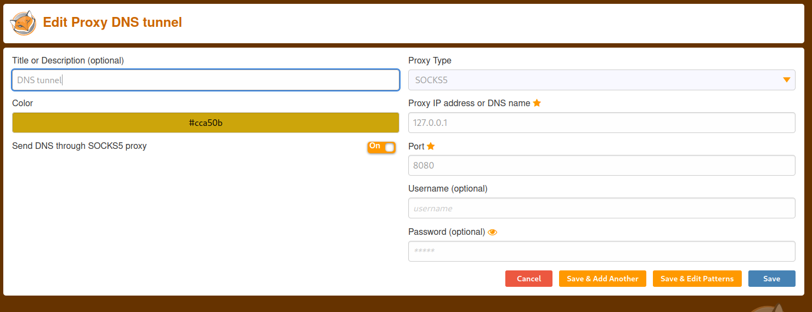
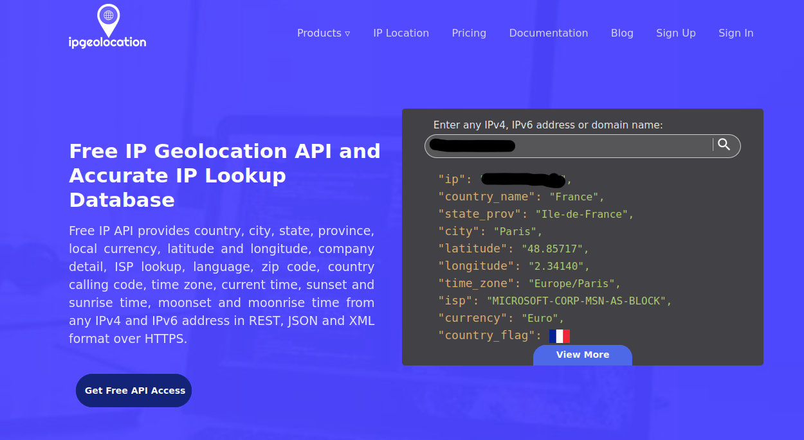
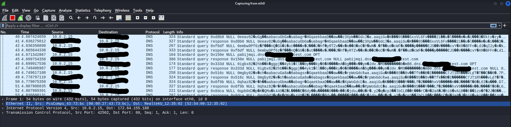
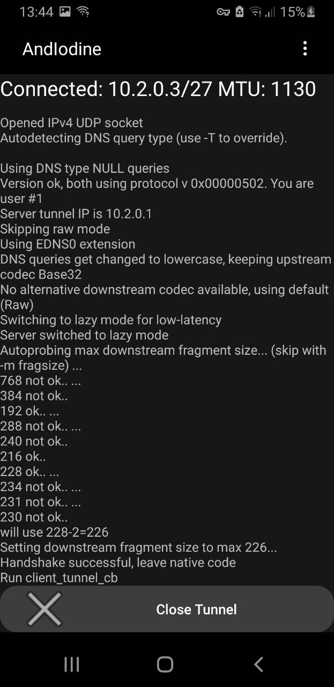
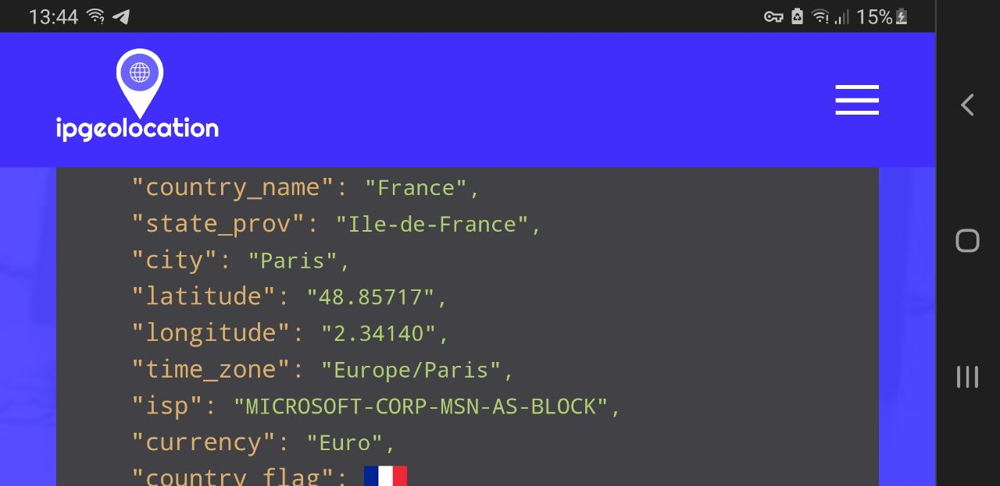

# DNS tunneling

The idea of this technique is to use the DNS protocol to route all the traffic, just like a VPN! Of course this method will make your connection slower but will allow you to bypass certain systems like network filters or captive portals. Obviously, you could use this to exfiltrate data too.

The reason why this works is that normally when captive portals or firewalls rules are setup, the administrators block all TCP and UDP connections when certain rule is met but they forget about checking DNS queries. This means that, if all our traffic is routed through DNS, we will be able to bypass all this protections.

## Requisites

- A VPS or machine that can be reached from the Internet for DNS requests without problems.
- This little tool installed both in the client and the server that will handle the tunnel: [Iodine](https://github.com/yarrick/iodine).
- Obviously a Domain.

## Server setup

First of all we need to setup our VPS to be the authoritative DNS for one of our domains or subdomains (I prefer the second option to be honest). The procedure to do this looks like it is different from vendor to vendor so I will focus on Cloudflare.

Setup in one of our domains a NS record for a subdomain or our whole domain. In my case I will setup `dns.test.com` NS record to point to my VPS  `vps.francecentral.cloudapp.azure.com`. This will tell Cloudflare that now, the authoritative DNS server is our VPS so the DNS queries should be sent to it. Make sure you point your NS record to an A record, at least in Cloudflare this is necessary and the record creation will fail if you try to use an IP address or a CNAME.

With that out of the way, go to your server and install [Iodine](https://github.com/yarrick/iodine). Now execute this (Make sure port 53 TCP/UDP is available):

```bash
raptor@kestrel:~$ sudo iodined -f 10.2.0.1 dns.test.com
Enter tunnel password: 
Opened dns0
Setting IP of dns0 to 10.2.0.1
Setting MTU of dns0 to 1130
Opened IPv4 UDP socket
Opened IPv6 UDP socket
Listening to dns for domain dns.test.com
```

This will start the tool in server mode, the 10.2.0.1 IP is just the /24 CIDR block that the tunnel will use, for example:  

```
 SERVER ------------------------------------ CLIENT
10.2.0.1                                    10.2.0.2
```

Make sure that the IP block used by the tunnel is not already in use by any of your client/server adapters. The password it is used to authenticate the clients and avoid unknown users.

### Troubleshooting

Port 53 TCP/UDP has to be reachable and obviouly useable by [Iodine](https://github.com/yarrick/iodine). If you have properly setup the network rules for your VPS to allow traffic to this port but you are still having problems, probably you have the service `systemd-resolved` running in the port 53. Change the file `/etc/resolv.conf` to point to a public DNS server and stop the service.

## Client setup

Once the Server is prepared, let’s connect to it. In our machine we will need [Iodine](https://github.com/yarrick/iodine) too, luckily Kali already has it. Just execute this (The password is the one you configured in the server earlier):

```bash
┌──(kali㉿kali)-[~]
└─$ sudo iodine -f -r vps.francecentral.cloudapp.azure.com dns.test.com                1 ⨯
Enter password: 
Opened dns0
Opened IPv4 UDP socket
Sending DNS queries for dns.test.com to REDACTED
Autodetecting DNS query type (use -T to override).
Using DNS type NULL queries
Version ok, both using protocol v 0x00000502. You are user #0
Setting IP of dns0 to 10.2.0.2
Setting MTU of dns0 to 1130
Server tunnel IP is 10.2.0.1
Skipping raw mode
Using EDNS0 extension
Switching upstream to codec Base128
Server switched upstream to codec Base128
No alternative downstream codec available, using default (Raw)
Switching to lazy mode for low-latency
Server switched to lazy mode
Autoprobing max downstream fragment size... (skip with -m fragsize)
768 ok.. 1152 ok.. ...1344 not ok.. ...1248 not ok.. ...1200 not ok.. 1176 ok.. 1188 ok.. will use 1188-2=1186
Setting downstream fragment size to max 1186...
Connection setup complete, transmitting data.
```

The output should be like that if everything went ok. You can also verify that the tunnel is open by going to a terminal and checking `ifconfig`, if you have the adapter `dns0` all is good:

```bash
┌──(kali㉿kali)-[~]
└─$ ifconfig dns0
dns0: flags=4305<UP,POINTOPOINT,RUNNING,NOARP,MULTICAST>  mtu 1130
        inet 10.2.0.2  netmask 255.255.255.224  destination 10.2.0.2
        unspec 00-00-00-00-00-00-00-00-00-00-00-00-00-00-00-00  txqueuelen 500  (UNSPEC)
        RX packets 0  bytes 0 (0.0 B)
        RX errors 0  dropped 0  overruns 0  frame 0
        TX packets 1  bytes 48 (48.0 B)
        TX errors 0  dropped 0 overruns 0  carrier 0  collisions 0
```

Now we can setup a SOCKS5 proxy and start routing our traffic, I recommend to use SSH for this to make sure the traffic is encrypted, otherwise the traffic can be intercepted and read if using insecure protocols (Remember that DNS is not encypted):

```bash
┌──(kali㉿kali)-[~]
└─$ ssh -D 8080 -q -C -N raptor@10.2.0.1 -i Projects/dns-tunnel/raptor.pem
```

Some notes about this command:

- The IP address used: 10.2.0.1 is our VPS at the end of our DNS tunnel
- The -D option is just telling SSH where the SOCKS5 proxy will listen for requests in our machine
- The -q is just for quiet operation
- The -N will tell SSH that we don’t want to execute commands so no prompt
- And the most important option, -C. This will compress the traffic to reduce the bandwidth, what is something you are gonna be thankful about since the DNS tunnel is not what you will call something fast.

Now just tunnel your traffic through the proxy! You can use something like `proxychains` or the OS proxy configuration to start tunneling stuff through the tunnel.

In my case I will just setup Mozilla to use the proxy. I love FoxyProxy so let’s setup the proxy there:



My VPS is located in Paris and as you can see the traffic is being routed from there:



Also check this Wireshark capture, weird DNS queries everywhere!



This is just [Iodine](https://github.com/yarrick/iodine) encoding all our packages in DNS queries and sending them through the DNS protocol, as you can see is our VPS who is anwering to all of them.

### Android

If you want to use all this in an Android device you would need to root it or use this: [andiodine / andiodine · GitLab](https://gitlab.com/andiodine/andiodine).

Basically with this app we are doing the same as we did in the previous section but without the SSH tunnel part. That means 2 things:

1. The traffic is not encrypted but if you use secure protocols everything should be fine (As usual you know).
2. The routing is not performed by SSH and it is the Linux server the one doing the job.

The second point is the problem, we need to make sure that the server is able to forward traffic and also that it is working as a NAT to avoid problems when the packages return. To get all this working I wrote this script that setup IP formarding and NAT before running [Iodine](https://github.com/yarrick/iodine) (Also it make sure to clean up everything when we close the server):

```bash
#! /bin/bash

echo "Preparing system for ip forwarding..."
echo 1 > /proc/sys/net/ipv4/ip_forward
iptables -t nat -A POSTROUTING -o eth0 -j MASQUERADE

echo
iodined -c -f 10.2.0.1 -P PaSSW0RD dns.test.com
echo

echo "Cleaning configuration..."
echo 0 > /proc/sys/net/ipv4/ip_forward
iptables -t nat -D POSTROUTING -o eth0 -j MASQUERADE
```

One more thing, sometimes your VPS provider can disable IP forwarding at the network interface level, make sure to enable it there too following the documentation (Thanks Azure for losing my time figuring this out).

Once this is ready, we can setup a conection in the Android application and start using our DNS tunnel without problems in our non-rooted phone!




