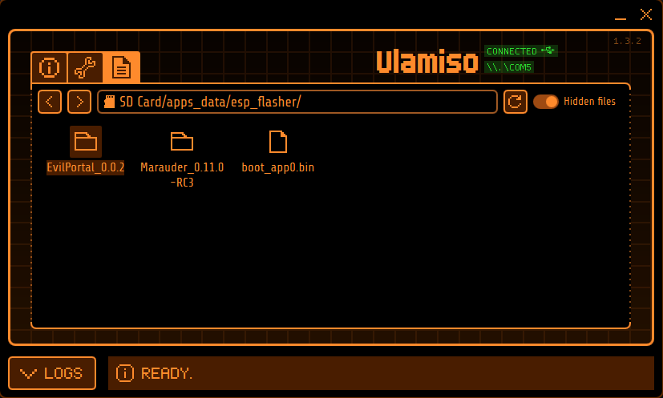
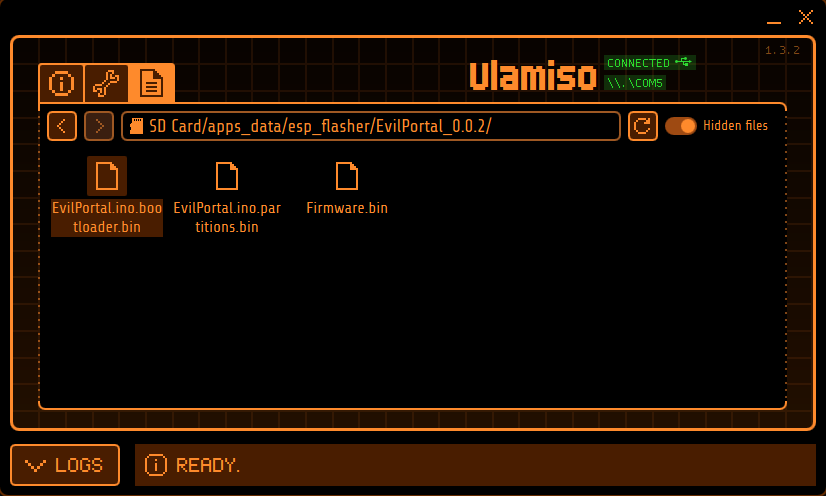
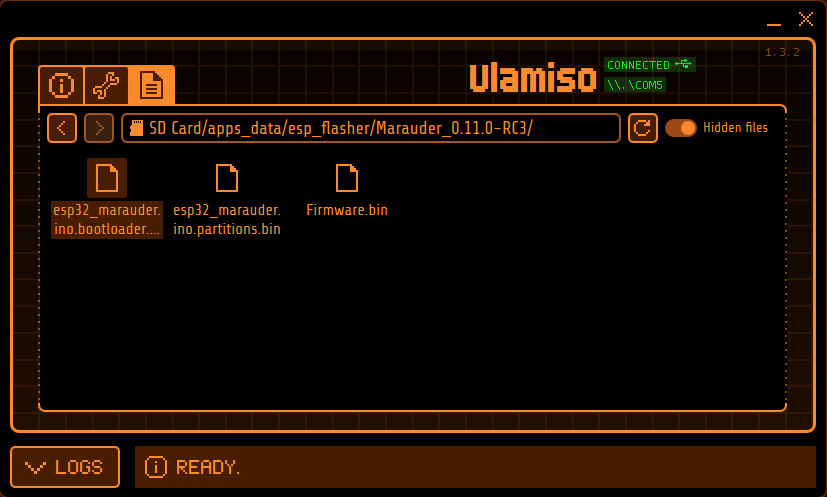
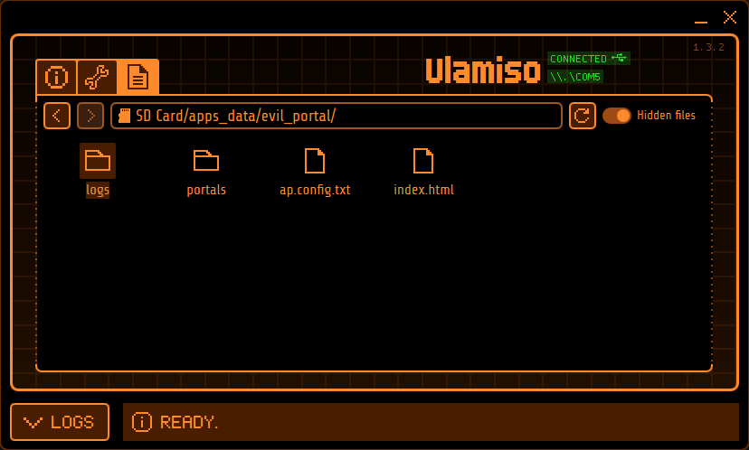
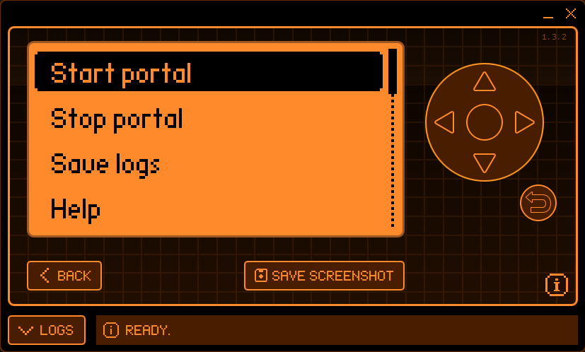
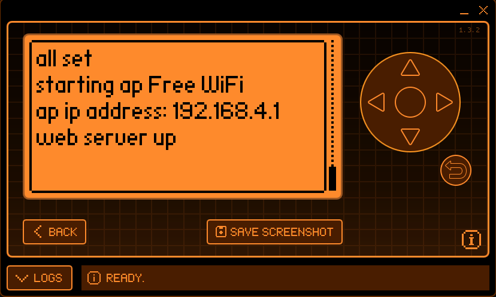
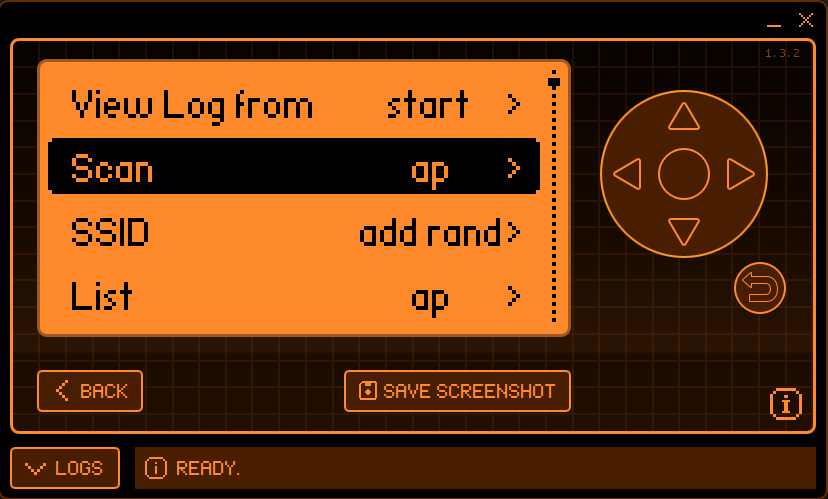
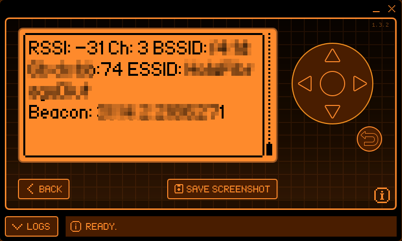

# How to setup the Flipper Zero for Wi-Fi attacks

Before starting, remember that performing any of the attacks explained in this post to networks without previous consent is illegal, this post information is for educational purposes only.

## Introduction

You may be thinking: "I just buy the Wi-Fi Flipper board and call it a day" well, not really. Even buying the Flipper Wi-Fi Devboard instead of making a custom module won't enable the Flipper to start de-authenticating people out of the box, you will need to flash the proper firmware.

This post will focus on the Flipper Wi-Fi Devboard but, in theory, the process described should work with anything based on the ESP32-S2 module that can be connected to the Flipper.

## Requisites

- Obviously a Flipper Zero.
- A Flipper Wi-Fi Devboard.
- Any device that can be use to transfer necessary files to the Flipper.

## Go time!

### Preparing necessary files

The Wi-Fi Devboard comes with a firmware call Black Magic flashed, this is enough for updating the Flipper through Internet or in-circuit debugging but not really to play with Wi-Fi networks. 

After looking around a bit, looks like flashing [Marauder firmware](https://github.com/justcallmekoko/ESP32Marauder) should provide all the functionality needed. The only problem here is that this firmware is obviously designed for [this tool](https://www.tindie.com/products/justcallmekoko/esp32-marauder/) and looks like certain features are not really working with the Flipper Wi-Fi Devboard. After some testing, the last firmware version that properly enable the Flipper to sniff Wi-Fi frames and safe PCAP files without problems is the [v0.11.0-RC3](https://github.com/justcallmekoko/ESP32Marauder/releases/tag/v0.11.0-RC3) (At the time of writing this post). Newer versions result in corrupted PCAP files for some reason. Also, looks like the evil portal functionality is only available by modifying the Wi-Fi Devboard to add a SD card slot to it. In theory, these limitations will be fixed in the future but for now, it is possible to use [an alternative firmware](https://github.com/bigbrodude6119/flipper-zero-evil-portal/releases) to circumvent the problem. 

Luckily it is possible to flash two different firmwares to the Flipper Wi-Fi Devboard and change between them, so here it is what is needed:

- [Marauder firmware v0.11.0-RC3](https://github.com/justcallmekoko/ESP32Marauder/releases/tag/v0.11.0-RC3), the file ending in `_sd_serial.bin` is the right one.
- Go to [the Marauder wiki](https://github.com/justcallmekoko/ESP32Marauder/wiki/update-firmware#using-spacehuhn-web-updater) and get the proper bootloader and partitions files.
- The Flipper Marauder app is called `[ESP32] WiFi Marauder` and can be installed from the Flipper application hub.
- [Last version of the evil portal firmware](https://github.com/bigbrodude6119/flipper-zero-evil-portal/releases), get the files called `evil_portal_sd_folder.zip` and `wifi_dev_board.zip` and unzip them.
- The Flipper app for the Evil Portal can be downloaded from [here](https://flipc.org/Nycz-lab/flipper-zero-evil-portal?branch=main&root=flipper/flipper-evil-portal&channel=release). Make sure to download the app for the proper Flipper firmware version.

### Copying files to the Flipper

The idea now is to take the downloaded stuff and organize it properly so the Flipper is able to use them. 

Let's start with the firmwares, first create a directory called `esp_flasher` and inside it prepare the next structure:
- `EvilPortal`
    - `EvilPortal.ino.bootloader.bin`
    - `EvilPortal.ino.partitions.bin`
    - `EvilPortal.ino.bin`
- `Marauder`
    - `esp32_marauder.ino.bootloader.bin`
    - `esp32_marauder.ino.partitions.bin`
    - `esp32_marauder_*_flipper_sd_serial.bin`
- `boot_app0.bin`

Next, get the contents of the `evil_portal_sd_folder.zip` and the `esp_flasher` directory created before and copy both directories to `apps_data` inside the Flipper SD card.

### Flashing

The flashing process will be done through the Flipper using the app called `ESP Flasher`, can be installed through the application hub. Since all the files are already prepared the process is pretty easy, just make sure to put the Flipper Wi-Fi Devboard in flashing mode: Once the board is connected to the Flipper, hold the boot button (Right button) and press the reset button.

Go into the flashing application in the Flipper and select `Switch to Firmware A`, if the board is in flashing mode no errors should appear on screen. Once that is finished, put the board again in flashing mode and this time choose the `Flash ESP` option. Setup these fields:
- **Bootloader:** `Marauder/esp32_marauder.ino.bootloader.bin`
- **Part Table:** `Marauder/esp32_marauder.ino.partitions.bin`
- **boot_app0:** `boot_app0.bin`
- **FirmwareA:** `Marauder/esp32_marauder_*_flipper_sd_serial.bin`
- **FirmwareB:** `EvilPortal/EvilPortal.ino.bin`
- Hit `FLASH` and wait.

After some time, the process should complete successfully and only one last step is needed. Right now only the partitions for the Marauder firmware are flashed into the board so the EvilPortal partitions need to be flashed aswell. Go to the flashing application, select `Switch to Firmware B` and then go again into the `Flash ESP` option (Remember to put the board into flashing mode everytime!):
- **Part Table:** `EvilPortal/EvilPortal.ino.partitions.bin`
- Hit `FLASH` and wait.

You may have noticed that the `EvilPortal/EvilPortal.ino.bootloader.bin` was not flashed, well only one bootloader can be flashed into the board at once. Luckily both firmware bootloaders are similar so, at least at the time of writing, this flashing process should be enough.

## Last thoughts

Once the flashing process is complete everything should be good to go. Switching between the Marauder firmware (Firmware A) and the Evil Portal firmware (Firmware B) can be achieved through the `ESP Flasher` app so it is possible to use both the `[ESP32] WiFi Marauder` and `[ESP32] Evil Portal` apps without any problems using the proper firmware.

The part of configuring an evil portal or using the Marauder app is not covered here. Just go to their repective documentation pages and take a look, the hard part is already done I promise!

**NOTE: If someone wants to know a bit more about how the ESP32 chip works, [this StackOverflow question](https://stackoverflow.com/questions/67149410/what-are-the-files-boot-app0-bin-and-bootloader-dio-80m-bin-for-esp32-arduin) is awesome.**
