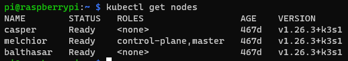
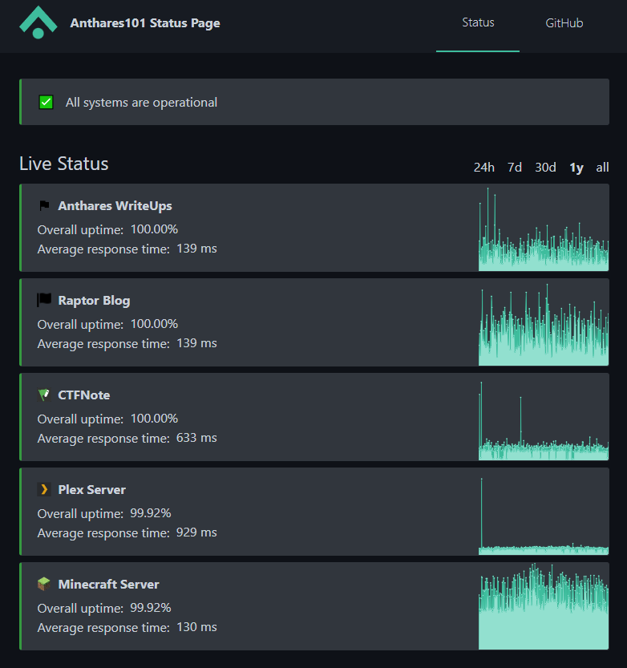
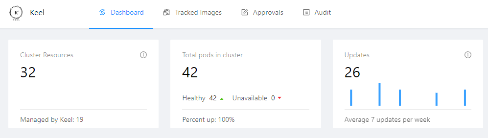

# MAGI Project a year later

How has MAGI behaved in the last year? Is the Kubernetes cluster even alive? Well, the header image is kind of spoiling the answers to those questions but, since the idea of the post is talking a bit about the implication of having an on premise Kubernetes cluster, you may be interested in continue reading.

## Is MAGI still running?

You probably already knew the answer but yes! Is still running.



All the nodes are healthy and running up to date, I have some applications running and everything is pretty smooth right now. The maintenance of the cluster was not the easier at the begining but I was able to ease the process a lot with scripts and Ansible. Later in the post we will talk a bit about that.

## How about the availability?

This is another of the questions you may have, the cluster is alive and running fine now but during all this time was always the case? Obviusly no, I had some downtimes caused by typical on premise problems: blackouts, problems during updates, crashing applications, hardware failures... But I have to say the uptime is not that bad, you can actually check that in: https://status.anthares101.com/, around 99.9% after a year (Both my write ups page and this blogs are hosted on GitHub so ignore those two).



Of course the availability of VPS in a cloud provider is far better and you dont have to deal with hardware stuff but what is the fun of that?

## Maintenance is key

If you want a system to run for a long time, you need maintenance. I knew that at the time so that is why I decided to make the process as painless as possible, manually updating systems and applications or creating backups by hand... too much work, so here is how I did it.

### Updates

#### Docker images

The cluster is not the only asset I have as you may know, for the cluster storage I use a fourth Raspberry Pi that also host different local services in my network using Docker containers. To make sure all the applications running in Docker get updated regularly, I use [Watchtower](https://containrrr.dev/watchtower/), it is really easy to use and will make sure every container is running with the latest image once it is setup.

#### Kubernetes images

For the cluster I needed something similar, Watchtower is not an option to keep Kubernetes pods running with the latest images so I started looking around for alternatives. I came up with [Keel](https://keel.sh/), a Kubernetes operator to automate Helm, Deployments, StatefulSet and DaemonSet updates.

The process of installing it is pretty easy, the problem I had is that the official repository only build images for x86 systems and not ARM. Since the official repository support seems... gone, I created a [fork of it](https://github.com/anthares101/keel) and using the magic of GitHub actions I automated the process of pulling new changes from the official repository to keep the fork updated and also automated the build and push of the Keel image for both ARM and x86 to [DockerHub](https://hub.docker.com/r/anthares101/keel-arm) so I could use it without problems in my cluster.



Once I had all running, nearly all the images in the cluster are managed by Keel so I don't need to update them one by one.

#### K3S and Linux

Well I created a little Ansible playbook to update all the cluster nodes OS, the K3S version and also the monitoring stack. You can find the playbook [here](https://github.com/anthares101/k3s-pi-cluster-upgrade).

Using that and a little script, I’m able to update everything in my home lab!

```bash
#! /bin/bash

# raspi-maintenance
echo "Updating cluster nodes, K3S and monitoring stack..."
(cd ~/Cluster/k3s-pi-cluster-upgrade && ansible-playbook main.yaml -K)

echo "Updating this system..."
sudo apt update && sudo apt dist-upgrade -y

if [ -f /var/run/reboot-required ]; then
  echo 'System updated! Reboot required...'
  sudo reboot
fi

echo 'All updated!'
```

The script is run from the fourth Raspberry Pi I mentioned earlier.

### BackUps

I also created a little script to backup important stuff to my disks array (My fourth Pi manage a RAID1 array for storage) to make sure I have everything in a single place. This allows me to just launch a single `rsync` command to sync everything important in my disk array with my cold backup.

```bash
#! /bin/bash
# raspi-backup

YELLOW='\033[0;33m'
NC='\033[0m' # No Color

echo -e "${YELLOW}K3S backup in progress...${NC}"
K3S_BACKUP_NAME="k3s-backup.tar.gz"
ssh -t melchior "sudo tar -czf /tmp/$K3S_BACKUP_NAME /var/lib/rancher/k3s/server && sudo chown pi:pi /tmp/$K3S_BACKUP_NAME"
scp melchior:/tmp/$K3S_BACKUP_NAME ~/Raid/Private/Anthares/Vault/Backups/RaspberryBackups/$K3S_BACKUP_NAME
ssh melchior rm -f /tmp/$K3S_BACKUP_NAME

echo -e "${YELLOW}Home backup in progress...${NC}"
HOME_BACKUP_NAME="home-backup.tar.gz"
tar -czf ~/Raid/Private/Anthares/Vault/Backups/RaspberryBackups/$HOME_BACKUP_NAME ~/.ssh ~/.kube ~/Raspi-opt ~/Cluster ~/Docker

echo -e "${YELLOW}Docker volumes backup in progress...${NC}"
DOCKER_VOLUMES_BACKUP_NAME="docker-volumes-backup.tar.gz"
sudo tar -czf ~/Raid/Private/Anthares/Vault/Backups/RaspberryBackups/$DOCKER_VOLUMES_BACKUP_NAME /var/lib/docker/volumes/
sudo chown pi:pi ~/Raid/Private/Anthares/Vault/Backups/RaspberryBackups/$DOCKER_VOLUMES_BACKUP_NAME
```

It is not perfect but it works fine for me. Again, this script is run from my fourth Raspberry Pi.

## Last thoughs

The process of thinking about how to make sure everything was automated was long. I had to install stuff, build all these scripts and playbooks... but at the end it was worth it. 

Before having all this ready, I could spent hours updating things here an there, making sure I had backups for pretty much everything... But now I can simply use two commands (maybe three if you count the `rsync` one) from my fourth Pi a call it a day:

```bash
raspi-maintenance
raspi-backup
```

Probably, the cluster would not have survived until now without all this process to ease the maintenance of it but once nearly everything is automated? As long as the hardware does not die, I will make sure the cluster stays alive for a long time. The importance of automation guys!
