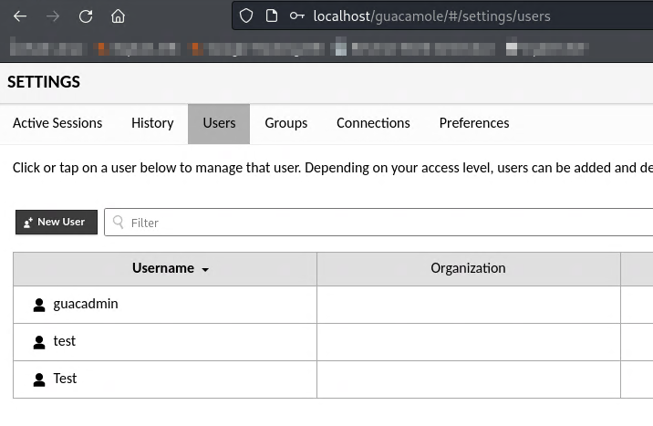
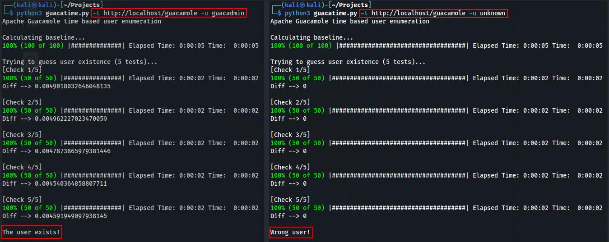

# Time based user enumeration in Apache Guacamole

Is this even a thing? Well, according to OWASP it is! And to my surprise it could work extremelly well given the right scenario. Remember that performing any of the attacks explained in this post to networks without previous consent is illegal, this post information is for educational purposes only.

## Setup

Let's prepare the environment, I deployed a Tomcat Guacamole instance (v1.5.4) and generated some users. If you want to replicate a similar lab, you can do it with [this repo and Docker](https://github.com/boschkundendienst/guacamole-docker-compose).



## The idea

Now that we have something to play with, is time to see why this vector is going to work. I decided to use Guacamole for the PoC because is a pretty known software and the way the login form works when using the [JDBC driver](https://github.com/apache/guacamole-client/blob/1.5.4/extensions/guacamole-auth-jdbc/modules/guacamole-auth-jdbc-base/src/main/java/org/apache/guacamole/auth/jdbc/user/UserService.java#L370-L394) is the perfect scenario:

```python
public ModeledAuthenticatedUser retrieveAuthenticatedUser(AuthenticationProvider authenticationProvider, Credentials credentials) throws GuacamoleException {

    // Get username and password
    String username = credentials.getUsername();
    String password = credentials.getPassword();

    // Retrieve corresponding user model, if such a user exists
    UserModel userModel = userMapper.selectOne(username);
    if (userModel == null)
        return null;

    // Verify provided password is correct
    byte[] hash = encryptionService.createPasswordHash(password, userModel.getPasswordSalt());
    if (!Arrays.equals(hash, userModel.getPasswordHash()))
        return null;

    // Create corresponding user object, set up cyclic reference
    ModeledUser user = getObjectInstance(null, userModel);
    user.setCurrentUser(new ModeledAuthenticatedUser(authenticationProvider, user, credentials));

    // Return now-authenticated user
    return user.getCurrentUser();

}
```

By reviewing the code published on GitHub it is possible to observe that, during the login process, the calculation of the hash of the password sent in the form is only performed if the user entered is valid. This different behavior of the application depending on the user entered would allow an attacker to send a password with many characters to cause a difference in server response times when a user is or is not valid.

The idea would be as follows:
- First, several requests are made to obtain the server response time using an incorrect user (a random value, for example) and any password. 
- Then, the average response time is calculated by eliminating from the sample possible outliers, i.e. response times that are out of the ordinary due to the network or any other disturbance. The idea is to make the mean as robust as possible. 
- Once the previous average is obtained, which will be called baseline from now on, proceed to take the username whose existence is to be checked and perform again the process described above to calculate the baseline average. Importantly, the password used in this case must have many characters to force a significant time difference in server responses.
- Finally, the baseline and the new mean obtained must be taken and compared. If the new mean is higher than the base mean, the user entered exists in the database because the password hash calculation has been performed. In case the values of the averages are very similar, sometimes the new average is lower, the entered user is not valid.

## Exploit time!

In order to achieve everything I commented before, I created [a little Python script](https://github.com/anthares101/ethical-hacking/blob/master/exploits/guacatime.py) that should be able to perform the exploitation process. It can be seen how it is possible to discern between a valid and an invalid user by analyzing the response times of the application.



Keep in mind that this is a local Guacamole intance, the network is not a problem. For targets accross the network you may need to play with some of the script parameters in order to get reliable results.

**NOTE: As you may already have already guessed, this technique is not only effective against Apache Guacamole. Any software using a similar login system is vulnerable.**

## Any fix?

A logical question here is, how could I avoid this? An interesting solution is to add a "dummy" hashing operation even if the user does not exist, which should avoid the compute difference between a valid and a non valid user. The thing is that even with that sort of fix, the connection to the database itself could mean a similar vector based on time (More complex though).

Putting our "dummy" hash into the database forcing a call to it could be enough to mask the compute discrepancies but, even then, the database may experiment little differences in response times for values that are often requested so an attack variant could still work. 

<p align="center">
    
</p>

You may be thinking that, since the exploit abuse a long password to increase the server response window when a user exists, a limitation in the submited password could be a solution. The problem is again the same, the database response times.

The non resilient nature of the possible fixes is what make this kind of vulnerabilities hard to circumvent. After dicussing the problem, the Guacamole maintainers decided the hardening change they plan to introduce in the future Guacamole version to add brute force protection should be enough to mitigate this technique. Until then, systems like Fail2ban shoud do the work.
