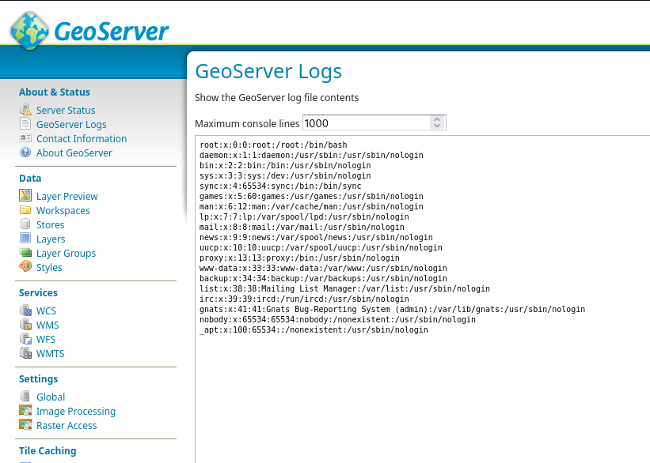
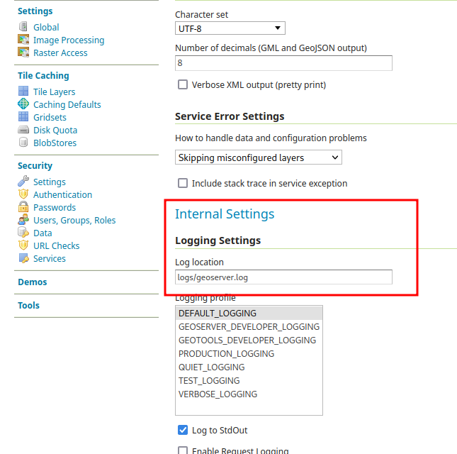
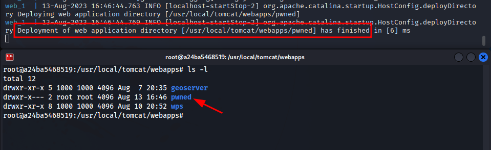
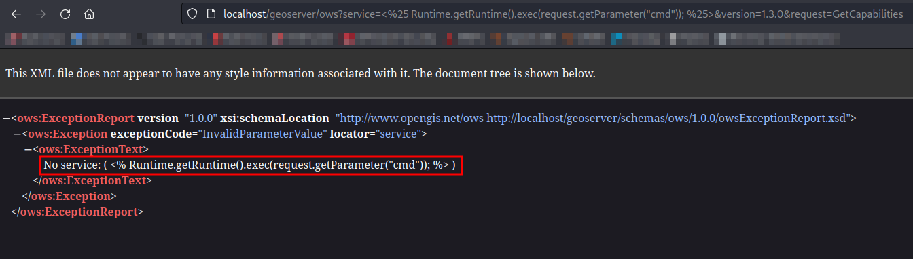
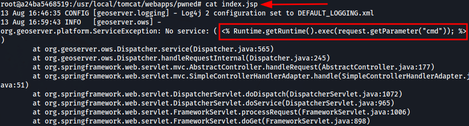
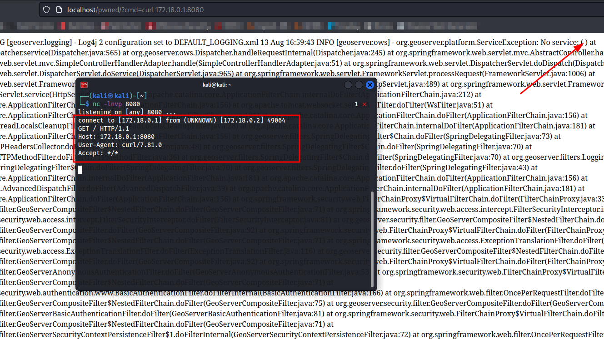

# Exploiting GeoServer path traversal vulnerability (CVE-2023-41877)

# Exploiting GeoServer path traversal vulnerability (CVE-2023-41877)

Before starting, remember that performing any of the attacks explained in this post to networks without previous consent is illegal, this post information is for educational purposes only.

## What is Geoserver?

[Geoserver](https://github.com/geoserver/geoserver) is an open-source software server written in Java that allows users to share and edit geospatial data. Designed for interoperability, it publishes data from any major spatial data source using open standards.

## The vulnerability

### Description

**NOTE: [CVE-2023-41877](https://cve.mitre.org/cgi-bin/cvename.cgi?name=CVE-2023-41877) states that only Geoserver versions 2.23.4 and prior are affected, this is not true. All Geoserver versions until this day are vulnerable if proper mitigation is not applied!**

At the time of writting this article, all Geoserver versions allows privileged users to change the location of the application log file to any path in the host system as long as the user running the application has enough permissions to read the chosen path. If the Geoserver user also has write permissions, the application will even create a new file and the needed directories to match the log path set in the configuration.

Abusing the commented behaviour, a Geoserver administrator could both read system files or even overwrite them if the user running Geoserver has enough permissions. The next image shows how after changing the log file location to `/etc/passwd`, the application leaks its contents:

### Is RCE possible?

If Geoserver is deployed using Tomcat the answer is probably yes! In case of the other deployment method, Jetty, RCE may still be possible but it would require a bit more imagination like abusing another services running.

Focusing on Tomcat the idea is simple, changing the log file path to a index.jsp inside a subdirectory under `webapps` directory will trigger a new application deployment by the servlet container. At this point, an attacker could inject a webshell in the logs and, by accessing the application deployed before, it would get code execution. Why this work with Tomcat and not with Jetty? Even though Jetty is also a servlet container, it does not support JSP files execution by default so this attack vector is mitigated.

### Proof of concept

First of all, it is necessary to get access to the administration panel, so a privileged account is needed. Also, as mention before, the Geoserver application needs to be running on top of Tomcat.

The Geoserver administration panel offers the option to change the location of the log file to a path selected by an administrator in Global settings page.

By changing that path to something like `../../pwned/index.jsp`, a new directory called "pwned" is created in the webapps Tomcat directory. Checking the Tomcat logs it is possible to see that a new application called "pwned" has been deployed.

Inside that new directory, the file `index.jsp` is now used by Geoserver to store its logs. Using the default logging profile of Geoserver, a JSP webshell could be injected to the logs by forcing an error with a request to the Geoserver API.

Visiting the new application deployed at `http://localhost/pwned/` with the GET parameter `cmd` set to a system command would allow an attacker to execute arbitrary code on the server.

As can be seen, the injected JSP code is not displayed as part of the response since it is being executed.

## Mitigation

The only mitigation available is to define `GEOSERVER_LOG_FILE` as system property, environment variable, or servlet context parameter, preventing the UI global setting provided from being used.

A note about this was included in the [official Geoserver documentation](https://docs.geoserver.org/latest/en/user/production/config.html#logging-configuration-hardening) to help with the hardening of production systems.

## References

- https://github.com/geoserver/geoserver
- https://cve.mitre.org/cgi-bin/cvename.cgi?name=CVE-2023-41877
- https://github.com/geoserver/geoserver/security/advisories/GHSA-8g7v-vjrc-x4g5
- https://docs.geoserver.org/latest/en/user/production/config.html#logging-configuration-hardening
- https://github.com/geoserver/geoserver/pull/7144

